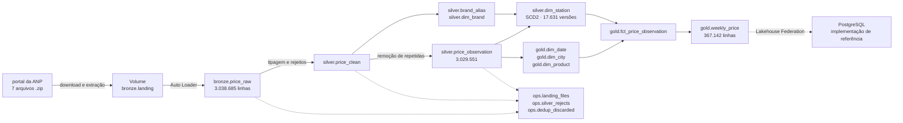

# databricks-lakehouse-anp

Reconstrução do data warehouse de preços de combustíveis da ANP em arquitetura
lakehouse no Databricks, a partir dos mesmos arquivos brutos de uma implementação
existente em PostgreSQL.

A pergunta do projeto é onde cada arquitetura ganha e onde a ferramenta é
exagero, com medição no lugar de opinião.

A hipótese de partida era que o Spark seria exagero para três milhões de linhas.
A medição mostrou que não é bem assim. Para carga em lote o Spark é o caminho
mais rápido, por um motivo estrutural. O exagero apareceu em outro lugar, nas
técnicas de organização de arquivos.

O critério de sucesso é objetivo: a camada gold precisa reproduzir as medidas da
implementação de referência. Se reproduzir, a comparação vale. Se não reproduzir,
a divergência vira achado.

---

## Resultado

As duas implementações foram comparadas por consulta federada, lendo o PostgreSQL
de dentro do Databricks como catálogo externo. Não houve conferência de números
anotados à mão. A comparação é `LEFT ANTI JOIN` e `FULL OUTER JOIN` entre as duas
bases.

| Medida | Databricks | PostgreSQL |
|---|---:|---:|
| Observações no fato | 3.029.551 | 3.029.551 |
| Versões de posto (SCD2) | 17.631 | 17.631 |
| Postos distintos | 14.059 | 14.059 |
| Bandeiras consolidadas | 56 | 56 |
| Trocas de bandeira | 1.960 | 1.960 |
| Municípios | 462 | 462 |
| Linhas no resumo semanal | 367.142 | 367.142 |

Consultas que fecham a equivalência:

```sql
-- versões que existem em apenas um dos lados: 0 nos dois sentidos
SELECT count(*) FROM anp.silver.dim_station d
LEFT ANTI JOIN neon_anp_catalog.core.dim_station n
    ON n.cnpj = d.reseller_cnpj AND n.valid_from = d.valid_from;

-- semanas com contagem divergente: 0
WITH db AS (SELECT week_start_date, count(*) AS n FROM anp.gold.weekly_price GROUP BY 1),
     ne AS (SELECT week_start_date, count(*) AS n FROM neon_anp_catalog.analytics.mv_weekly_price GROUP BY 1)
SELECT count(*) FROM db FULL OUTER JOIN ne USING (week_start_date)
WHERE coalesce(db.n, 0) <> coalesce(ne.n, 0);
```

O valor do exercício não está na equivalência em si. Está em que toda divergência
encontrada no caminho tem causa identificada. Nenhuma delas apareceria com uma
implementação só.

---

## Arquitetura



Plataforma: Databricks Free Edition, processamento serverless, Unity Catalog.
Catálogo `anp`, com schemas `bronze`, `silver`, `gold` e `ops`. Dois volumes:
`bronze.landing` guarda os CSVs extraídos e `ops.checkpoints` guarda o estado do
Auto Loader. Eles ficam separados porque um leitor que enxerga o próprio controle
trata esses arquivos como dado novo.

O deploy usa Databricks Asset Bundles versionados no repositório, aplicados pelo
GitHub Actions a cada push em `main`. O repositório é a fonte da verdade e o
workspace pode ser recriado com um comando, o que também protege contra a
exclusão por inatividade do Free Edition.

---

## Estrutura do repositório

```
databricks.yml                 raiz do bundle, variáveis e targets
resources/
  job_setup.yml                catálogo, schemas e volumes
  job_bronze.yml               download e ingestão
  job_silver.yml               limpeza, bandeiras e dimensão de postos
  job_gold.yml                 dimensões, fato e resumo semanal
  job_pipeline.yml             pipeline completo encadeado, agendamento pausado
  job_ops.yml                  medições de organização de arquivos e de motor
src/
  00_setup_catalog.py          namespace do projeto
  10_landing_anp.py            baixa os zips e extrai para o volume
  20_bronze_autoloader.py      ingestão incremental, sem conversão
  30_silver_clean.py           tipagem, normalização e tabela de rejeitos
  35_silver_brand.py           catálogo de bandeiras e mapa de rótulos
  40_silver_station.py         remoção de repetidas e SCD2 com verificações
  50_gold_dimensions.py        calendário, município e produto
  60_gold_fact.py              fato e resumo semanal
  70_ops_optimize.py           organização de arquivos e tempo de consulta
  80_bench_spark_pandas.py     mesmo resumo em Spark e em duas versões de pandas
.github/workflows/deploy.yml   validate e deploy do bundle
```

---

## Decisões técnicas

**O nome do arquivo carrega o hash do zip de origem.** O Auto Loader controla o
que já leu pelo caminho do arquivo. A ANP republica o semestre corrente conforme
coleta, então gravar com nome fixo faria uma republicação ser ignorada sem aviso.
Com `ca-2026-01__a1b2c3d4.csv`, conteúdo novo vira arquivo novo. As duas versões
ficam no volume e dá para auditar a diferença.

**A bronze não converte nada.** Todas as dezesseis colunas entram como texto. Uma
regra de limpeza aplicada na entrada só pode ser revista recarregando a fonte, e
ela sempre precisa ser revista.

**O layout do arquivo é conferido a cada execução.** Os nomes de coluna vêm do
cabeçalho e são comparados por posição contra a lista esperada, ignorando acento e
maiúsculas. Se algo mudar, o job falha com mensagem clara em vez de gravar nulo.

**A remoção de linhas repetidas segue um critério fixo.** São 20 linhas excedentes
em três milhões, e quatro delas têm preços diferentes entre si. O dado não diz
qual está certa, então a escolha é arbitrária, mas precisa dar o mesmo resultado em
qualquer execução. As descartadas ficam em `ops.dedup_discarded`.

**O mapa de bandeiras foi escrito à mão.** Nenhuma regra automática separa
mudança de rótulo de troca real de distribuidora, pelo motivo explicado em
Achados. Cada par tem a justificativa gravada na própria tabela, e o notebook
recusa mapa com rótulo apontando para outro rótulo do mapa ou com destino que não
existe no dado.

**As semanas do começo e do fim da série ficam marcadas, não removidas.** Elas são
truncadas pela forma como a série começa e termina, mas apagar linha na origem
tira de quem consome a chance de discordar do critério.

**Os percentis são exatos.** O `percentile_approx` é bem mais barato, mas comparar
mediana aproximada com mediana exata criaria diferença onde não existe.

**As chaves das dimensões são hashes do valor natural, e não sequenciais.** A
mesma entrada gera a mesma chave em qualquer execução, e é isso que permite
comparar as duas bases com anti-join.

**A conexão federada foi criada pela interface, e não por notebook.** A senha do
usuário de leitura ficaria em texto no repositório se estivesse num arquivo
versionado.

**A tabela do fato nasce sem particionamento nem clustering.** A otimização é
comparada contra esse estado.

---

## Achados

**O Auto Loader casa colunas pelo nome, e não pela posição.** Passar um schema com
nomes próprios não faz o leitor aplicá-lo por posição. Como nenhum nome batia com
o cabeçalho em português, as dezesseis colunas ficaram nulas e todo o conteúdo foi
para `_rescued_data`, sem erro e sem aviso. O sintoma inicial confundiu, porque
essa coluna guarda o caminho do arquivo de origem e por isso nunca fica nula. O
diagnóstico saiu de `count(DISTINCT _rescued_data)`: sete valores significariam
apenas o caminho, e três milhões significavam o conteúdo inteiro.

**Os nomes de coluna perdem o acento quando o schema é fixado.** O cabeçalho traz
`Município` e o leitor entrega `Municipio`. A conferência inicial comparava as
strings exatas e falhava com uma mensagem em que os dois nomes pareciam idênticos
na tela. A comparação passou a ignorar acento e maiúsculas, já que o objetivo é
identificar a coluna e não reproduzir a grafia.

**O arquivo `ca-2025-01` tem 9.114 linhas totalmente em branco.** Todas as
dezesseis colunas nulas, concentradas em um único semestre. Não são coletas sem
preço, são linhas vazias de publicação.

**A mudança de rótulo de bandeira leva anos.** `VIBRA ENERGIA` para `VIBRA`
aparece em 189 datas diferentes ao longo de três anos, e `ALESAT` para `ALE` em 62
datas ao longo de dois. A ideia inicial era separar mudança de rótulo de troca
real pela simultaneidade, porque uma renomeação afetaria centenas de postos na
mesma semana. O dado mostrou o contrário: a ANP troca o rótulo posto a posto. Foi
por isso que o mapa passou a ser escrito à mão.

**A fonte corrige grafia entre arquivos semestrais.** Um endereço com espaço duplo
(`AVENIDA MAJOR  PINHEIRO FROES`) aparece corrigido no semestre seguinte. Com
apenas `trim` aplicado, isso abria versão nova na dimensão de postos sem que nada
tivesse mudado de fato. Sete versões vieram daí, seis delas começando em janeiro
ou julho. A silver passou a reduzir espaços internos a um só.

**Um resumo semanal não pode tirar o mês da data da coleta.** Numa semana que
atravessa a virada de mês, a coluna `month_start_date` varia dentro do grupo e a
mesma combinação de semana, município e produto se divide em duas linhas. Foram 23
semanas afetadas e 4.103 linhas a mais. O mês passou a vir do início da semana.

**Uma comparação entre motores mede antes de tudo a implementação.** O primeiro
resultado apontava pandas 62 vezes mais lento que Spark no mesmo resumo semanal. O
número era real e a conclusão seria falsa. O tempo estava na chamada do
interpretador Python por grupo, e não no motor. A versão vetorizada reduziu a
diferença a um fator que se explica pelo custo de carregar os dados na memória.

**Ganho de desempenho medido sem controle mede o ambiente.** Ver a seção de
Medições: o `OPTIMIZE` aparentava 27% a 38% de ganho sobre uma tabela cujo layout
não tinha mudado um único byte.

**As semanas do começo e do fim da série ficam em 75,1% da cobertura típica.**
Medido comparando a soma de observações por semana contra a mediana das semanas
do meio.

**O `infinity` é a decisão certa no PostgreSQL e é o que impede o dado de
atravessar.** A implementação de referência usa `infinity` em `valid_to`, o que
deixa o `daterange` aberto à direita e permite a constraint de exclusão funcionar
sem precisar de uma data inventada para representar "sem fim". Ler essa coluna
por Lakehouse Federation devolve `integer overflow`, porque o valor não tem
representação no tipo `DATE` do Spark. Aqui a versão vigente usa `9999-12-31`, que
é feio e funciona em qualquer lugar. Nenhuma das duas escolhas é errada. Elas
otimizam coisas diferentes, e só a comparação revela o custo de cada uma.

---

## Medições

Todas as medições ficam em `ops.benchmark_runs`, identificadas por execução.
Ambiente: Databricks Free Edition, processamento serverless, Photon.

### O fato inteiro cabe em um arquivo

3.029.551 linhas ocupam 37,4 MB em Parquet, em um único arquivo. O CSV de origem
tem cerca de 500 MB. Esse número governa todo o resto.

### `OPTIMIZE` e liquid clustering não fazem diferença nessa escala

| Consulta | ganho do aquecimento | ganho da organização |
|---|---:|---:|
| agregacao_ampla | 19,7% | +0,5% a +4,0% |
| filtro_seletivo | 32,5% | +2,1% a +7,3% |
| lookup_posto | 14,9% | −4,6% a −2,3% |

As duas chamadas de `OPTIMIZE` retornaram métricas zeradas: nenhum arquivo
adicionado, nenhum removido. O número de arquivos ficou em 1 nas quatro fases.

A primeira rodada dessa medição indicava ganho de 27% a 38% e estava errada. O
layout físico era idêntico entre as fases, então o ganho não podia vir do comando.
Vinha do ambiente esquentando ao longo das consultas. A fase de controle repete a
medição sem alterar nada, e a diferença que ela sozinha captura é o aquecimento. O
que sobra é o efeito real da organização de arquivos. Sem esse controle, o
resultado apresentável seria falso.

Custo colateral: habilitar clustering disparou `UPGRADE PROTOCOL` e
`ROW TRACKING BACKFILL` na tabela, subindo a versão do protocolo Delta. É uma
mudança de compatibilidade de leitores em troca de nenhum ganho medido.

### O mesmo resumo semanal em Spark e em pandas

| Implementação | tempo |
|---|---:|
| Spark, join e agregação | 2,92 s |
| pandas, carga para a memória | 12,99 s |
| pandas, preparo do join e da semana | 2,10 s |
| pandas vetorizado, agregação | 3,59 s |
| pandas com função Python, agregação | 183,29 s |

As três implementações produzem 367.142 grupos, com diferença máxima de `0,0` na
mediana e no p10. O percentil exato do Spark e o `quantile` do pandas coincidem
integralmente.

A implementação pesa 51 vezes. Declarar os quantis como
`lambda x: x.quantile(...)` dentro de `groupby.agg` obriga o pandas a chamar o
interpretador uma vez por grupo, o que dá 367 mil grupos vezes duas lambdas.
Trocar por `groupby(...).quantile([...])`, que roda em C, levou a agregação de
183,29 s para 3,59 s. Nenhuma decisão de arquitetura neste projeto chegou perto
desse fator.

O Spark ganha porque não precisa carregar os dados na memória. Os 12,99 s de
carga são o item mais caro do lado do pandas e sozinhos custam 4,4 vezes o resumo
inteiro em Spark. Com os dados já na memória, a distância cai de 6,4 para 1,9
vezes, o que muda a resposta conforme o processo seja um job em lote ou um
serviço que fica no ar.

---

## Onde cada arquitetura difere

| Aspecto | PostgreSQL | Databricks |
|---|---|---|
| Vigências que não podem se sobrepor | `EXCLUDE USING gist` recusa a escrita errada | não existe equivalente, virou conferência depois da carga |
| Fim de vigência em aberto | `infinity` | `9999-12-31`, para poder ser lido por outros motores |
| Controle do que já foi carregado | catálogo de arquivos com carga idempotente | Auto Loader com checkpoint em volume |
| Controle de acesso | usuários `owner` e `bi_reader` separados no banco | Unity Catalog |
| Idempotência | migrações numeradas com registro e checksum | bundle declarativo aplicado por deploy |
| Organização física | particionamento por trimestre | um arquivo de 37,4 MB, `OPTIMIZE` e clustering sem efeito medível |
| Orquestração | GitHub Actions com cron | Lakeflow Job com dependências entre tarefas |

A comparação deixa explícito o ponto central. No PostgreSQL a integridade é
responsabilidade do banco e a escrita errada simplesmente não acontece. No Delta
a integridade é responsabilidade do código, e por isso precisa de conferência.

A `dim_station` tem três regras que precisam valer sempre: cada posto tem uma
única versão vigente, as vigências de um posto são contínuas e não se sobrepõem, e
cada observação encontra exatamente uma versão. Elas são conferidas a cada carga
justamente porque a constraint do banco não existe aqui.

---

## Limitações conhecidas

- `TOTALENERGIES` para `NEXTA`, com 18 postos, não foi classificado nem como
  mudança de rótulo nem como troca real. O dado não decide, e tratar como mudança
  de rótulo apagaria um evento que pode ter acontecido.
- Quatro combinações de data, posto e produto têm preços diferentes entre si,
  todas do mesmo posto em duas datas. São resolvidas por um critério arbitrário,
  porém estável. O dado não permite decidir.
- A coluna `valid_to` da implementação de referência não pode ser lida por
  Lakehouse Federation enquanto usar `infinity`.
- O Free Edition oferece apenas processamento serverless, sem R nem Scala, com
  cota diária. As cargas completas foram executadas uma vez por etapa.
- A dimensão de posto é montada de uma vez a partir do histórico completo. A carga
  incremental por `MERGE` ainda não foi comparada com ela.

---

## Como reproduzir

Pré-requisitos: conta no Databricks Free Edition, Databricks CLI autenticada e um
repositório no GitHub com os secrets `DATABRICKS_HOST` e `DATABRICKS_TOKEN`. O
token precisa dos escopos `workspace`, `files`, `jobs`, `scim` e `identity`, que
foram suficientes para o deploy do bundle.

```bash
git clone https://github.com/mrmansini/databricks-lakehouse-anp.git
cd databricks-lakehouse-anp

# ajuste o host do workspace em databricks.yml
databricks bundle validate -t dev
databricks bundle deploy -t dev
```

No workspace, execute os jobs nesta ordem:

1. `setup_catalog`, que cria catálogo, schemas e volumes
2. `bronze_ingest`, que baixa os sete semestres e carrega a bronze
3. `silver_build`, com limpeza, bandeiras e dimensão de postos
4. `gold_build`, com dimensões, fato e resumo semanal

Ou, em uma execução só, `pipeline_full`, que encadeia as oito tarefas com
dependências explícitas. O agendamento vem pausado, porque em ambiente de
desenvolvimento um disparo automático consome cota sem ninguém esperando por ele.

As medições ficam nos jobs `ops_optimize` e `ops_bench_engines`, e não fazem parte
do pipeline de dados.

O parâmetro `full_refresh` do `bronze_ingest` descarta o checkpoint do Auto Loader
e reprocessa o volume inteiro. O padrão é `false`.

A comparação federada é opcional e depende de uma conexão PostgreSQL criada em
Catalog, External Data, Connections, apontando para uma instância com a
implementação de referência.

---

Identificadores em inglês, documentação em português.
